# AI Context Tracker — Software Architecture

> **Document Version:** 1.0  
> **Date:** July 13, 2026  
> **Status:** Draft — Awaiting Approval  
> **Prerequisite:** [Product Specification v1.0](file:///C:/Users/VISHW/.gemini/antigravity-ide/brain/825cbabc-4df0-4eaf-aad3-f54f8dbd9d8d/product_specification.md)

---

## Table of Contents

1. [System Overview](#1-system-overview)
2. [Extension Architecture](#2-extension-architecture)
3. [Data Flow Diagrams](#3-data-flow-diagrams)
4. [Folder Structure](#4-folder-structure)
5. [Dependency Graph](#5-dependency-graph)
6. [Service Worker (Background)](#6-service-worker-background)
7. [Content Scripts](#7-content-scripts)
8. [Website Adapters](#8-website-adapters)
9. [Token Estimation Engine](#9-token-estimation-engine)
10. [Summary Engine](#10-summary-engine)
11. [Degradation Detection Engine](#11-degradation-detection-engine)
12. [Storage Layer](#12-storage-layer)
13. [Model Database](#13-model-database)
14. [UI Layer](#14-ui-layer)
15. [Settings System](#15-settings-system)
16. [Notification Engine](#16-notification-engine)
17. [Message Passing Protocol](#17-message-passing-protocol)
18. [Sync Strategy](#18-sync-strategy)
19. [Cross-Browser Compatibility](#19-cross-browser-compatibility)
20. [Performance Budget & Considerations](#20-performance-budget--considerations)
21. [Security Model](#21-security-model)
22. [Privacy Architecture](#22-privacy-architecture)
23. [Future Extensibility](#23-future-extensibility)
24. [Sequence Diagrams](#24-sequence-diagrams)
25. [Interface Contracts](#25-interface-contracts)

---

## 1. System Overview

### 1.1 Architecture Style

**Event-driven, layered architecture** with strict unidirectional data flow.

There is **no backend server**. The entire system runs locally in the browser. This is a fundamental architectural constraint, not a cost-saving measure — it is the core privacy guarantee.

### 1.2 Layered Architecture

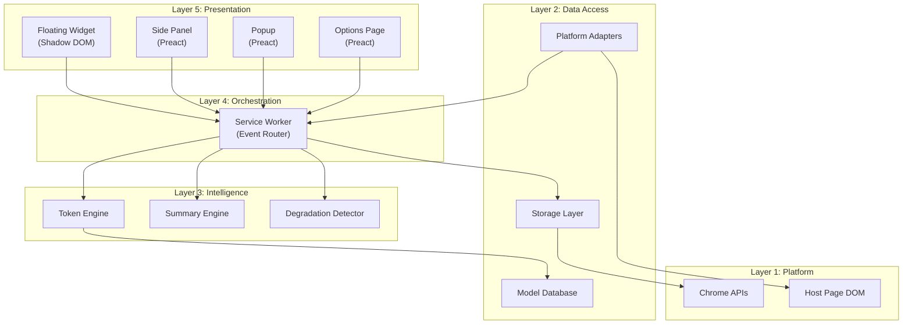

### 1.3 Design Principles

| Principle | Implementation |
|:---|:---|
| **Separation of Concerns** | Each layer has one job. Content scripts read the DOM. Service worker orchestrates. Engines compute. UI renders. |
| **Dependency Inversion** | Core engines depend on interfaces, not platform implementations. Adapters implement those interfaces. |
| **Single Source of Truth** | `chrome.storage` is the canonical state. All contexts read from it. No stale in-memory copies. |
| **Event-Driven** | No polling. MutationObserver → message → state update → UI re-render. |
| **Fail Gracefully** | If an adapter breaks, the extension shows "estimation mode" — never crashes. |
| **Privacy by Architecture** | No network layer exists. There is no code path that could send data externally. |

---

## 2. Extension Architecture

### 2.1 Component Overview

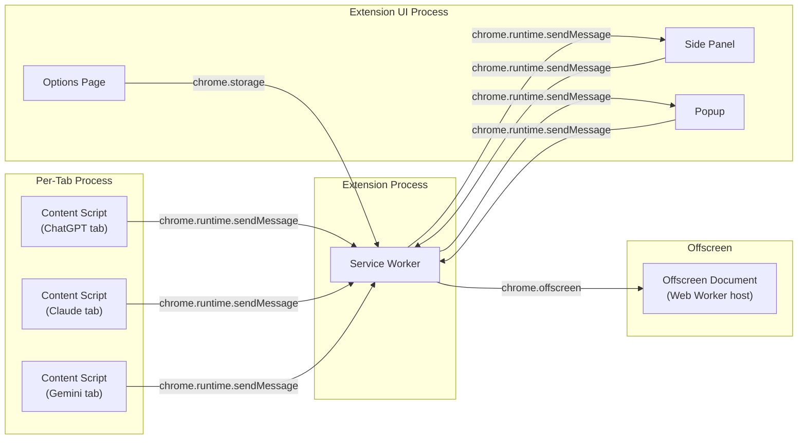

### 2.2 Manifest V3 Entrypoints

| Entrypoint | File | Purpose | Injection |
|:---|:---|:---|:---|
| **Service Worker** | `background/index.ts` | Central event hub, state management | Always running (event-driven) |
| **Content Script** | `content/index.ts` | DOM observation, UI injection | Auto-injected on matched hosts |
| **Side Panel** | `sidepanel/index.html` | Detailed dashboard | User-activated |
| **Popup** | `popup/index.html` | Quick status, settings shortcut | Click extension icon |
| **Options** | `options/index.html` | Full settings page | User-navigated |
| **Offscreen** | `offscreen/index.html` | Web Worker host for heavy compute | Created on-demand by service worker |

### 2.3 Why Each Entrypoint Exists

> [!NOTE]
> **Popup vs Side Panel — why both?**
> The **popup** serves as a quick-glance status card (< 2 seconds of interaction). The **side panel** is a persistent workspace that stays open alongside the AI chat. Different interaction patterns demand different UIs. The popup is also the fallback if the browser doesn't support the Side Panel API.

> [!NOTE]
> **Why Offscreen Document?**
> The service worker has no DOM access and no `Worker` constructor. To run `js-tiktoken` in a Web Worker (CPU-intensive tokenization off the main thread), we need an offscreen document to host the Worker. This is Chrome's prescribed pattern for heavy computation in MV3.

---

## 3. Data Flow Diagrams

### 3.1 Primary Data Flow — Token Counting

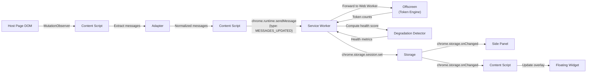

### 3.2 Data Flow — Transfer Summary Generation

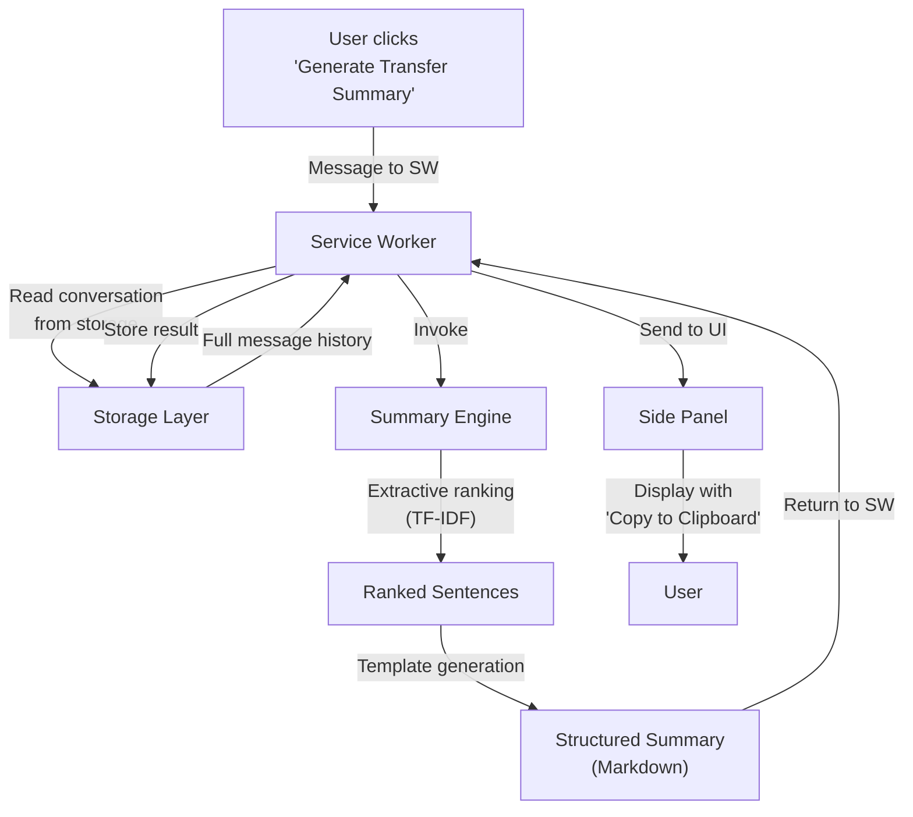

### 3.3 Data Flow — Settings

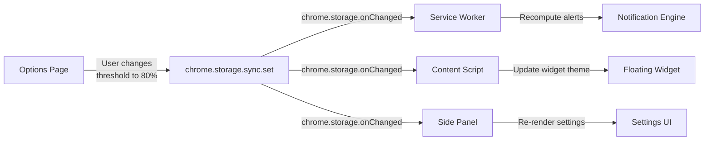

---

## 4. Folder Structure

```
ai-context-tracker/
├── .github/
│   └── workflows/
│       ├── ci.yml                    # Lint, test, type-check on PR
│       ├── release.yml               # Build & publish to CWS
│       └── adapter-health.yml        # Scheduled DOM selector tests
│
├── public/
│   ├── icons/
│   │   ├── icon-16.png
│   │   ├── icon-32.png
│   │   ├── icon-48.png
│   │   └── icon-128.png
│   └── _locales/                     # i18n (future)
│       └── en/
│           └── messages.json
│
├── src/
│   ├── entrypoints/
│   │   ├── background/
│   │   │   ├── index.ts              # Service worker entry
│   │   │   ├── event-router.ts       # Message dispatch
│   │   │   ├── state-manager.ts      # Centralized state coordination
│   │   │   └── lifecycle.ts          # Install, update, startup hooks
│   │   │
│   │   ├── content/
│   │   │   ├── index.ts              # Content script entry
│   │   │   ├── observer.ts           # MutationObserver setup
│   │   │   ├── message-extractor.ts  # DOM → normalized messages
│   │   │   └── widget-injector.ts    # Shadow DOM widget injection
│   │   │
│   │   ├── sidepanel/
│   │   │   ├── index.html            # Side panel HTML shell
│   │   │   ├── index.tsx             # Preact entry
│   │   │   ├── App.tsx               # Root component
│   │   │   └── styles.css            # Panel styles
│   │   │
│   │   ├── popup/
│   │   │   ├── index.html            # Popup HTML shell
│   │   │   ├── index.tsx             # Preact entry
│   │   │   ├── App.tsx               # Root component
│   │   │   └── styles.css            # Popup styles
│   │   │
│   │   ├── options/
│   │   │   ├── index.html            # Options HTML shell
│   │   │   ├── index.tsx             # Preact entry
│   │   │   ├── App.tsx               # Root component
│   │   │   └── styles.css            # Options styles
│   │   │
│   │   └── offscreen/
│   │       ├── index.html            # Offscreen document shell
│   │       └── index.ts              # Web Worker host
│   │
│   ├── adapters/
│   │   ├── types.ts                  # Adapter interface contract
│   │   ├── registry.ts               # Adapter registry & auto-detection
│   │   ├── base-adapter.ts           # Abstract base with shared logic
│   │   ├── chatgpt/
│   │   │   ├── adapter.ts            # ChatGPT DOM adapter
│   │   │   ├── selectors.ts          # DOM selectors (isolated for easy updates)
│   │   │   └── model-detector.ts     # Detect GPT model variant
│   │   ├── claude/
│   │   │   ├── adapter.ts            # Claude DOM adapter
│   │   │   ├── selectors.ts
│   │   │   └── model-detector.ts
│   │   └── gemini/
│   │       ├── adapter.ts            # Gemini DOM adapter
│   │       ├── selectors.ts
│   │       └── model-detector.ts
│   │
│   ├── engines/
│   │   ├── token/
│   │   │   ├── index.ts              # Token engine public API
│   │   │   ├── worker.ts             # Web Worker entry for tokenization
│   │   │   ├── strategies/
│   │   │   │   ├── types.ts          # TokenStrategy interface
│   │   │   │   ├── tiktoken.ts       # GPT tokenizer (js-tiktoken)
│   │   │   │   ├── bpe-approx.ts     # BPE approximation for Claude/Grok
│   │   │   │   └── char-ratio.ts     # Fallback character-ratio estimator
│   │   │   └── confidence.ts         # Confidence score calculator
│   │   │
│   │   ├── summary/
│   │   │   ├── index.ts              # Summary engine public API
│   │   │   ├── extractive.ts         # TF-IDF sentence ranking
│   │   │   ├── transfer-template.ts  # Structured transfer summary generator
│   │   │   ├── text-processing.ts    # Tokenization, stop words, stemming
│   │   │   └── stop-words.ts         # English stop word list
│   │   │
│   │   └── degradation/
│   │       ├── index.ts              # Degradation detector public API
│   │       ├── signals/
│   │       │   ├── types.ts          # DegradationSignal interface
│   │       │   ├── context-fill.ts   # Context window fill percentage
│   │       │   ├── repetition.ts     # Response repetition detector
│   │       │   ├── length-drift.ts   # Response length trend analyzer
│   │       │   ├── instruction-drift.ts  # Instruction adherence checker
│   │       │   └── explicit-forget.ts    # "I don't recall" pattern matcher
│   │       └── health-score.ts       # Composite weighted score calculator
│   │
│   ├── storage/
│   │   ├── index.ts                  # Storage layer public API
│   │   ├── session-store.ts          # chrome.storage.session wrapper
│   │   ├── local-store.ts            # chrome.storage.local wrapper
│   │   ├── sync-store.ts             # chrome.storage.sync wrapper
│   │   ├── idb-store.ts              # IndexedDB wrapper (conversation history)
│   │   ├── migrations.ts             # Schema version migrations
│   │   └── keys.ts                   # Centralized storage key constants
│   │
│   ├── models/
│   │   ├── index.ts                  # Model database public API
│   │   ├── registry.ts               # Model lookup & matching
│   │   └── data/
│   │       ├── openai.json           # GPT model specs
│   │       ├── anthropic.json        # Claude model specs
│   │       ├── google.json           # Gemini model specs
│   │       ├── xai.json              # Grok model specs (future)
│   │       └── perplexity.json       # Perplexity routing info (future)
│   │
│   ├── notifications/
│   │   ├── index.ts                  # Notification engine public API
│   │   ├── threshold-checker.ts      # Compare metrics against thresholds
│   │   └── alert-renderer.ts         # Format alerts for different UI targets
│   │
│   ├── messaging/
│   │   ├── types.ts                  # Message type definitions (discriminated union)
│   │   ├── sender.ts                 # Type-safe message sender with retry
│   │   ├── handler.ts                # Type-safe message handler registry
│   │   └── ports.ts                  # Long-lived port management
│   │
│   ├── settings/
│   │   ├── index.ts                  # Settings public API
│   │   ├── schema.ts                 # Settings schema + defaults + validation
│   │   └── migrations.ts             # Settings version migrations
│   │
│   ├── ui/
│   │   ├── components/               # Shared Preact components
│   │   │   ├── ContextMeter.tsx      # Circular/bar gauge for context fill
│   │   │   ├── HealthBadge.tsx       # 🟢🟡🟠🔴 indicator
│   │   │   ├── TokenCount.tsx        # Formatted token display
│   │   │   ├── ConfidenceBadge.tsx   # "Exact" / "~90% est." badge
│   │   │   ├── PlatformIcon.tsx      # AI platform logo component
│   │   │   └── ThemeProvider.tsx     # Dark/light theme context
│   │   │
│   │   ├── widget/                   # Floating overlay (injected into host page)
│   │   │   ├── Widget.tsx            # Root widget component
│   │   │   ├── widget.css            # Widget styles (injected into Shadow DOM)
│   │   │   └── mount.ts             # Shadow DOM creation & mount logic
│   │   │
│   │   └── hooks/
│   │       ├── useStorageState.ts    # Hook: reactive chrome.storage binding
│   │       ├── useMessages.ts        # Hook: subscribe to message channel
│   │       └── useSettings.ts        # Hook: typed settings access
│   │
│   ├── shared/
│   │   ├── constants.ts              # App-wide constants
│   │   ├── errors.ts                 # Custom error types
│   │   ├── logger.ts                 # Structured logger (dev-only in production)
│   │   ├── platform.ts              # Browser/platform detection utilities
│   │   └── types.ts                  # Shared TypeScript types
│   │
│   └── __tests__/
│       ├── adapters/                 # Adapter unit tests
│       ├── engines/                  # Engine unit tests
│       ├── storage/                  # Storage unit tests
│       └── e2e/                      # Playwright E2E tests
│
├── scripts/
│   ├── adapter-health-check.ts       # CI script to validate selectors
│   └── generate-model-data.ts        # Script to update model specs
│
├── ARCHITECTURE.md                    # ← This document
├── PROJECT.md                         # Project status tracker
├── CHANGELOG.md                       # Change log
├── TODO.md                            # Task tracker
├── LICENSE                            # License file
├── package.json
├── tsconfig.json
├── wxt.config.ts                      # WXT configuration
├── vitest.config.ts                   # Test configuration
└── .eslintrc.cjs                      # Linting configuration
```

### 4.1 Folder Structure Rationale

| Directory | Why It Exists |
|:---|:---|
| `entrypoints/` | WXT convention — each subfolder becomes a manifest entry. No manual manifest editing. |
| `adapters/` | Isolated from entrypoints because adapters are used by content scripts but tested independently. Selectors are in separate files so DOM changes require editing exactly one file per platform. |
| `engines/` | Pure computational modules with zero Chrome API dependencies. Can be unit tested in Node.js without browser environment. |
| `storage/` | Abstraction layer hiding chrome.storage/IndexedDB behind a uniform API. Enables migration support and future storage backend swaps. |
| `models/` | Static JSON data separated from logic. Can be updated independently (even via remote config in the future) without touching engine code. |
| `messaging/` | Type-safe message passing prevents the #1 source of runtime bugs in extensions: stringly-typed messages. |
| `ui/components/` | Shared between side panel, popup, and widget. No duplication. |
| `ui/widget/` | Separate from components because the widget has unique mounting requirements (Shadow DOM). |

---

## 5. Dependency Graph

### 5.1 Module Dependency Graph

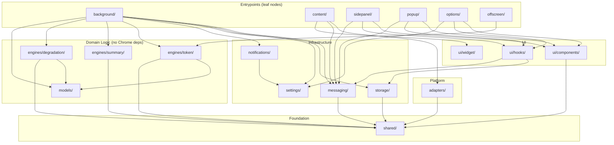

### 5.2 Dependency Rules

> [!IMPORTANT]
> These rules are enforced by ESLint import restrictions. Violations fail CI.

| Rule | Rationale |
|:---|:---|
| `engines/` **MUST NOT** import from `chrome.*` APIs | Engines must be testable in pure Node.js |
| `adapters/` **MUST NOT** import from `engines/` | Adapters only extract data; they don't process it |
| `ui/components/` **MUST NOT** import from `adapters/` | UI components receive data via props/hooks, never directly from DOM |
| `storage/` **MUST NOT** import from `engines/` or `adapters/` | Storage is a passive data layer |
| `shared/` **MUST NOT** import from any other `src/` module | It's the foundation; dependencies only flow downward |
| `entrypoints/` are the only modules that can import from all layers | They are composition roots |

### 5.3 External Dependencies (NPM)

| Package | Purpose | Size | Justification |
|:---|:---|:---|:---|
| `preact` | UI framework | ~3KB gzip | React DX at 1/13th the bundle size |
| `preact/hooks` | Hooks API | ~1KB gzip | Included with Preact |
| `js-tiktoken` | GPT tokenization | ~30KB gzip | Only loaded in offscreen Web Worker, not on every page |
| `zustand` | State management | ~2KB gzip | Lightweight, framework-agnostic, works with chrome.storage |
| `idb` | IndexedDB wrapper | ~1.5KB gzip | Type-safe, Promise-based IndexedDB access |

**Total payload per page (content script):** < 15KB gzip  
**Total payload (side panel/popup):** < 50KB gzip  
**Web Worker payload:** < 40KB gzip (includes tokenizer data)

> [!WARNING]
> **Hard rule: No dependency > 50KB gzip** enters the content script bundle. Content scripts execute on every matched page — every kilobyte matters. Heavy libraries (tokenizers, UI frameworks for panel) go into separate entrypoints that only load on demand.

---

## 6. Service Worker (Background)

### 6.1 Responsibilities

```
┌──────────────────────────────────────────────────────┐
│                  SERVICE WORKER                       │
├──────────────────────────────────────────────────────┤
│                                                      │
│  Event Router                                        │
│  ├── Receives messages from content scripts          │
│  ├── Dispatches to appropriate engine                │
│  └── Forwards results to UI contexts                 │
│                                                      │
│  State Manager                                       │
│  ├── Reads/writes chrome.storage                     │
│  ├── Maintains per-tab conversation state            │
│  └── Coordinates between multiple tabs               │
│                                                      │
│  Lifecycle Manager                                   │
│  ├── onInstalled → initialize defaults               │
│  ├── onStartup → restore state                       │
│  └── Tab tracking (active tab awareness)             │
│                                                      │
│  Offscreen Manager                                   │
│  ├── Creates offscreen document on demand            │
│  ├── Forwards tokenization requests                  │
│  └── Tears down when idle                            │
│                                                      │
│  Alarm Manager                                       │
│  ├── Periodic health checks                          │
│  └── Adapter staleness detection                     │
│                                                      │
└──────────────────────────────────────────────────────┘
```

### 6.2 State Recovery Pattern

Since service workers are ephemeral:

```
Service Worker Wakes Up
    │
    ├── Register all event listeners (synchronous, top-level)
    │
    ├── On first message received:
    │   └── Lazy-load state from chrome.storage.session
    │       └── If empty → load from chrome.storage.local
    │           └── If empty → initialize with defaults
    │
    └── Process event with restored state
```

> [!TIP]
> We use **lazy state initialization** rather than eager loading in the service worker's top-level scope. This keeps wake-up time minimal (< 50ms target) and avoids blocking event registration on async storage reads.

---

## 7. Content Scripts

### 7.1 Injection Strategy

```
Content Script Lifecycle
    │
    ├── WXT auto-injects on matched URLs
    │   ├── https://chatgpt.com/*
    │   ├── https://chat.openai.com/*
    │   ├── https://claude.ai/*
    │   └── https://gemini.google.com/*
    │
    ├── Detect platform via URL + DOM signals
    │   └── Load corresponding adapter
    │
    ├── Initialize MutationObserver
    │   ├── Target: conversation container (adapter provides selector)
    │   ├── Config: { childList: true, subtree: true, characterData: true }
    │   └── Callback: debounced (300ms) message extraction
    │
    ├── Inject floating widget (Shadow DOM)
    │
    └── Listen for storage changes → update widget
```

### 7.2 Content Script Size Budget

| Component | Max Size (gzip) |
|:---|:---|
| Core content script | 5KB |
| Active adapter | 3KB |
| Widget (Preact + CSS) | 6KB |
| **Total per-page** | **< 15KB** |

### 7.3 Page Visibility Optimization

```
Page becomes hidden (tab switch, minimize)
    └── observer.disconnect()
    └── Clear debounce timers

Page becomes visible
    └── Re-attach observer
    └── Full re-scan of conversation
    └── Resume normal operation
```

This prevents the extension from consuming CPU on background tabs.

---

## 8. Website Adapters

### 8.1 Adapter Interface

Every platform adapter must implement this contract:

```typescript
interface PlatformAdapter {
  /** Unique platform identifier */
  readonly platformId: PlatformId;

  /** URL patterns this adapter handles */
  readonly urlPatterns: string[];

  /** Check if this adapter can handle the current page */
  canActivate(url: string, document: Document): boolean;

  /** Get the conversation container element to observe */
  getConversationContainer(document: Document): Element | null;

  /** Extract all messages from the current conversation */
  extractMessages(container: Element): ConversationMessage[];

  /** Detect which model is currently active */
  detectModel(document: Document): ModelInfo | null;

  /** Health check — verify selectors still work */
  healthCheck(document: Document): AdapterHealthReport;
}
```

### 8.2 Adapter Registry

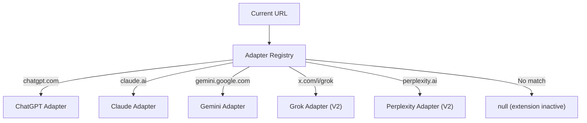

### 8.3 Selector Isolation Strategy

Each adapter isolates its DOM selectors in a dedicated `selectors.ts` file:

```typescript
// adapters/chatgpt/selectors.ts
export const SELECTORS = {
  conversationContainer: '[role="presentation"] main',
  messageWrapper: '[data-message-id]',
  messageRole: '[data-message-author-role]',
  messageContent: '.markdown',
  modelSelector: '[data-testid="model-selector"]',
  // Fallback selectors (less specific, more resilient)
  fallback: {
    conversationContainer: 'main .flex.flex-col',
    messageContent: '.prose, .whitespace-pre-wrap',
  }
} as const;
```

**Why separate files?** When ChatGPT updates its DOM (every 2-4 weeks), we edit exactly one file — `chatgpt/selectors.ts`. No engine code, no UI code, no other adapter code is touched.

### 8.4 Multi-Signal Extraction (Resilience)

Each adapter tries selectors in priority order:

```
1. Primary selectors (highest specificity, most accurate)
   └── aria-labels, data-attributes, role attributes
   
2. Structural selectors (medium specificity)
   └── DOM hierarchy patterns (parent > child relationships)
   
3. Content heuristics (lowest specificity, most resilient)
   └── Text pattern matching ("You:", code blocks, markdown patterns)
   
4. If all fail → report AdapterHealthReport.broken = true
   └── Extension shows "unable to read conversation" with link to report
```

### 8.5 Adapter Health Monitoring

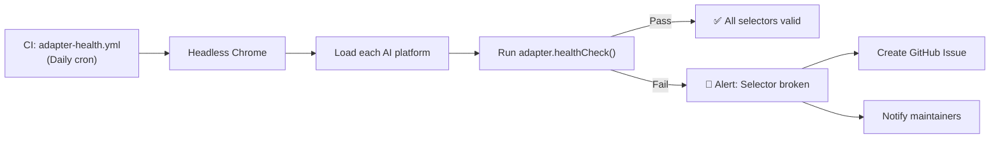

---

## 9. Token Estimation Engine

### 9.1 Architecture

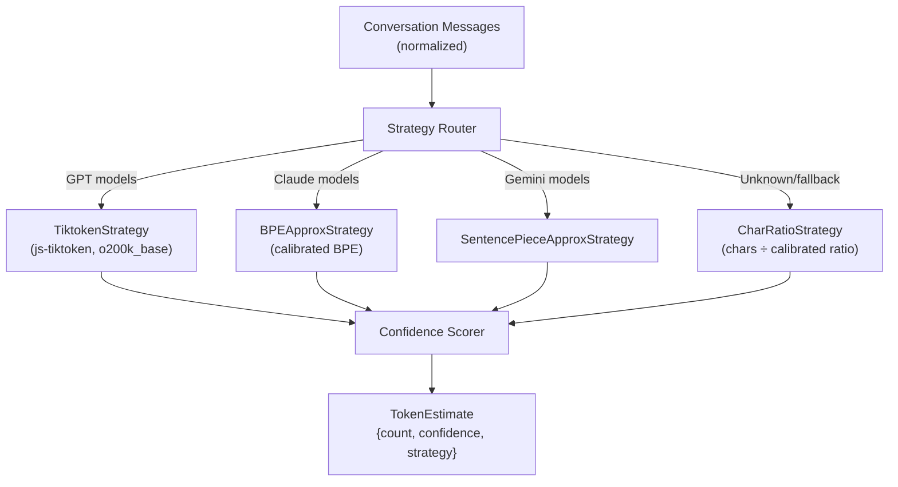

### 9.2 Strategy Interface

```typescript
interface TokenStrategy {
  readonly strategyId: string;
  readonly baseConfidence: number;  // 0-1, inherent accuracy of this strategy

  /** Count tokens for a single text string */
  countTokens(text: string): number;

  /** Count tokens for an entire conversation */
  countConversation(messages: ConversationMessage[]): ConversationTokenCount;
}

interface ConversationTokenCount {
  totalTokens: number;
  inputTokens: number;        // User messages
  outputTokens: number;       // AI responses
  systemTokens: number;       // System prompt (if detectable)
  perMessageCounts: Map<string, number>;  // messageId → count
}
```

### 9.3 Web Worker Offloading

Tokenization runs in a dedicated Web Worker to prevent blocking the main thread:

```
Content Script                    Service Worker                  Offscreen Document
     │                                 │                               │
     │ MESSAGES_UPDATED                │                               │
     ├────────────────────────────────>│                               │
     │                                 │  Ensure offscreen exists      │
     │                                 ├──────────────────────────────>│
     │                                 │                               │
     │                                 │  TOKENIZE_REQUEST             │
     │                                 ├──────────────────────────────>│
     │                                 │                      ┌────────┤
     │                                 │                      │Web     │
     │                                 │                      │Worker  │
     │                                 │                      │runs    │
     │                                 │                      │tiktoken│
     │                                 │                      └────────┤
     │                                 │  TOKENIZE_RESPONSE            │
     │                                 │<──────────────────────────────┤
     │                                 │                               │
     │                                 │  Update storage               │
     │                                 ├──> chrome.storage.session     │
     │                                 │                               │
```

### 9.4 Incremental Tokenization

**Problem:** Re-tokenizing the entire conversation on every keystroke is wasteful.

**Solution:** Cache per-message token counts. Only re-tokenize messages that changed:

```
Previous state: [msg1: 150, msg2: 200, msg3: 300]  Total: 650
New message arrives: msg4
→ Only tokenize msg4 (180 tokens)
→ New total: 830

Message msg2 edited:
→ Only re-tokenize msg2 (210 tokens)
→ New total: 840
```

This is possible because each message has a stable ID from the adapter.

---

## 10. Summary Engine

### 10.1 Architecture

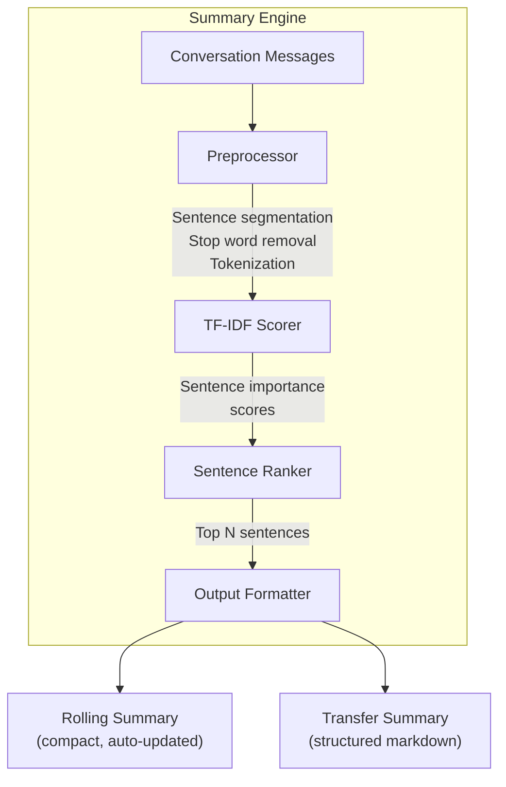

### 10.2 Rolling Summary

Updates automatically every N turns (configurable, default: 5).

```
Input: Full conversation (all messages)
Processing:
  1. Split all messages into sentences
  2. Compute TF-IDF for each sentence across the conversation
  3. Select top K sentences (K = conversation_length / 5)
  4. Order selected sentences chronologically
  5. Group by topic (adjacent high-similarity sentences)
Output: 3-5 bullet points summarizing the conversation
```

### 10.3 Transfer Summary Template

When the user clicks "Generate Transfer Summary":

```markdown
## Context Transfer Summary
**Generated by AI Context Tracker**
**Source:** Claude (claude.ai) | Model: Claude Fable 5
**Conversation Length:** 47 turns | ~85,000 tokens
**Generated:** 2026-07-13 14:30 UTC

### Key Topics Discussed
1. [Extracted topic 1]
2. [Extracted topic 2]
3. [Extracted topic 3]

### Important Decisions Made
- [Extracted decision point 1]
- [Extracted decision point 2]

### Current State
[Last 3 messages summarized]

### Key Code/Artifacts Referenced
[Extracted code block references, if any]

### Instructions for Continuation
Please continue this conversation. The key context is above.
Focus on: [Extracted current task from recent messages]
```

### 10.4 Why Not an LLM for Summaries?

| Factor | Extractive (TF-IDF) | LLM-based |
|:---|:---|:---|
| Privacy | ✅ Zero data exposure | ⚠️ Requires API call or local model |
| Speed | ✅ < 50ms for 100K tokens | ❌ Seconds to minutes |
| Accuracy | ⚠️ Medium (extracts, doesn't synthesize) | ✅ High (understands context) |
| Dependencies | ✅ Zero | ❌ API key or 500MB+ local model |
| Cost | ✅ Free | ❌ API costs or CPU/memory |

**Decision:** TF-IDF for MVP. The V2 roadmap includes optional WebLLM for users who opt into local model inference.

---

## 11. Degradation Detection Engine

### 11.1 Signal Pipeline

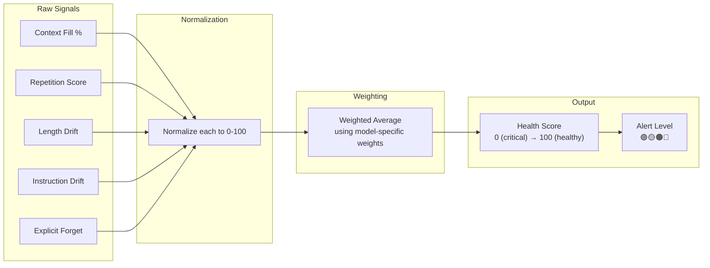

### 11.2 Signal Definitions

```typescript
interface DegradationSignal {
  readonly signalId: string;
  readonly weight: number;  // 0-1, contribution to composite score

  /** Compute this signal's value (0 = healthy, 100 = critical) */
  compute(context: DegradationContext): SignalResult;
}

interface DegradationContext {
  messages: ConversationMessage[];
  tokenCount: ConversationTokenCount;
  modelInfo: ModelInfo;
  contextWindowSize: number;
}
```

### 11.3 Default Signal Weights

| Signal | Weight | Rationale |
|:---|:---|:---|
| Context Fill % | 0.40 | Strongest predictor of degradation |
| Repetition Score | 0.20 | Clear indicator of model cycling |
| Length Drift | 0.15 | Subtle but reliable signal |
| Instruction Drift | 0.15 | Catches "system prompt amnesia" |
| Explicit Forget | 0.10 | Binary signal, rare but definitive |

### 11.4 Alert Thresholds (Defaults)

| Health Score | Level | Color | User Message |
|:---|:---|:---|:---|
| 80-100 | Healthy | 🟢 | Context is fresh |
| 60-79 | Caution | 🟡 | Performance may start declining |
| 40-59 | Warning | 🟠 | AI is likely losing context. Consider summarizing. |
| 0-39 | Critical | 🔴 | Context severely degraded. Start a new conversation or transfer. |

---

## 12. Storage Layer

### 12.1 Three-Tier Storage Architecture

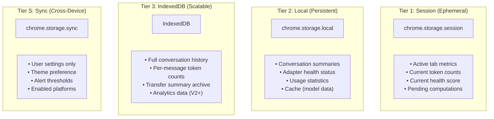

### 12.2 Storage Key Schema

```typescript
// storage/keys.ts — Centralized key definitions

export const STORAGE_KEYS = {
  // Session (Tier 1) — ephemeral, per-session
  session: {
    activeTabMetrics: (tabId: number) => `tab:${tabId}:metrics`,
    activeTabConversation: (tabId: number) => `tab:${tabId}:conversation`,
    offscreenActive: 'offscreen:active',
  },

  // Local (Tier 2) — persistent
  local: {
    adapterHealth: 'adapters:health',
    usageStats: 'stats:usage',
    lastKnownModels: 'models:lastKnown',
    schemaVersion: 'schema:version',
  },

  // Sync (Tier S) — cross-device settings
  sync: {
    settings: 'settings:v1',
  },

  // IndexedDB (Tier 3) — structured data
  idb: {
    dbName: 'ai-context-tracker',
    stores: {
      conversations: 'conversations',
      summaries: 'summaries',
      tokenCache: 'tokenCache',
    },
  },
} as const;
```

### 12.3 Storage Size Budget

| Tier | Limit | Our Target | Data |
|:---|:---|:---|:---|
| `chrome.storage.session` | 10MB | < 2MB | Active metrics only |
| `chrome.storage.local` | 10MB (unlimited with permission) | < 5MB | Summaries, health, cache |
| `chrome.storage.sync` | 100KB total, 8KB/item | < 2KB | Settings only |
| IndexedDB | Unlimited | < 50MB | Conversation history |

### 12.4 Schema Migrations

```typescript
// storage/migrations.ts
export const MIGRATIONS: Migration[] = [
  {
    version: 1,
    description: 'Initial schema',
    migrate: async (storage) => {
      // Set up initial structure
    },
  },
  {
    version: 2,
    description: 'Add per-message token cache',
    migrate: async (storage) => {
      // Migrate existing data
    },
  },
];
```

Every time the extension updates, the service worker checks `schemaVersion` and runs pending migrations in order.

---

## 13. Model Database

### 13.1 Static JSON Registry

```typescript
// models/data/openai.json
{
  "provider": "openai",
  "models": [
    {
      "modelId": "gpt-5.5",
      "displayName": "GPT-5.5",
      "contextWindow": 1000000,
      "defaultContextWindow": 272000,
      "tokenizer": "o200k_base",
      "inputCostPer1M": 2.50,
      "outputCostPer1M": 10.00,
      "releaseDate": "2026-03-15",
      "capabilities": ["text", "vision", "code"],
      "knownDegradationThreshold": 0.65
    },
    {
      "modelId": "gpt-5.4",
      "displayName": "GPT-5.4",
      "contextWindow": 272000,
      "tokenizer": "o200k_base",
      "inputCostPer1M": 1.50,
      "outputCostPer1M": 5.00,
      "releaseDate": "2025-11-01",
      "capabilities": ["text", "vision", "code"],
      "knownDegradationThreshold": 0.60
    }
  ]
}
```

### 13.2 Model Lookup Flow

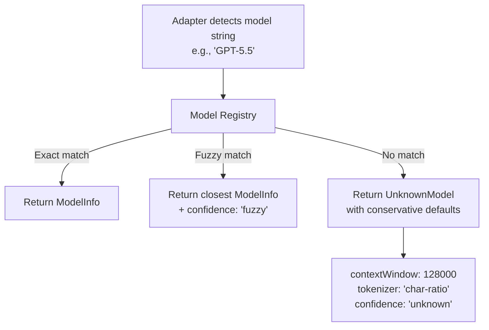

### 13.3 `knownDegradationThreshold`

This field captures the empirically observed context fill ratio where each model typically starts losing coherence. It's used by the degradation detector:

- GPT-5.5: 0.65 (degrades around 65% fill due to massive 1M context)
- Claude Fable 5: 0.70 (strong long-context performance)
- Gemini 3.1 Pro: 0.55 (early "lost-in-the-middle" issues)

These values are approximations updated based on community reports.

---

## 14. UI Layer

### 14.1 Floating Widget (Shadow DOM)

```
┌─────────────────────────────────┐
│ Host Page (chatgpt.com)         │
│                                 │
│  ┌──────────────────────────┐   │
│  │ Shadow DOM Container      │   │
│  │  ┌────────────────────┐  │   │
│  │  │  🟢 42% | 58K tok  │  │   │
│  │  │  ≈ 95% accurate    │  │   │
│  │  └────────────────────┘  │   │
│  │  :host { all: initial }  │   │
│  │  /* Widget CSS scoped */ │   │
│  └──────────────────────────┘   │
│                                 │
│  ┌──────────────────────────┐   │
│  │ Chat input area          │   │
│  └──────────────────────────┘   │
└─────────────────────────────────┘
```

**Widget states:**

| State | Display |
|:---|:---|
| Collapsed (default) | `🟢 42% | 58K` — minimal pill |
| Expanded (click) | Full metrics panel with meter, health, token details |
| Streaming | Animated counter updating in real-time |
| Error | `⚠️ Unable to read — click for details` |

### 14.2 Side Panel Layout

```
┌─────────────────────────────┐
│  AI Context Tracker    ⚙️   │
├─────────────────────────────┤
│                             │
│  ┌───────────────────────┐  │
│  │    Context Meter      │  │
│  │    ████████░░░  72%   │  │
│  │    144K / 200K tokens │  │
│  └───────────────────────┘  │
│                             │
│  Health: 🟡 Caution         │
│  Model: Claude Fable 5      │
│  Turns: 34                  │
│  Confidence: ~90% est.      │
│                             │
├─────────────────────────────┤
│  📋 Rolling Summary         │
│  • Discussed project arch   │
│  • Decided on React vs Vue  │
│  • Working on auth module   │
├─────────────────────────────┤
│  [🔄 Transfer Summary]      │
│  [📥 Export Conversation]    │
│  [⚙️ Settings]               │
└─────────────────────────────┘
```

### 14.3 Popup Layout

```
┌─────────────────────┐
│ AI Context Tracker   │
├─────────────────────┤
│ 🟢 42% context used │
│ ChatGPT · GPT-5.5   │
│ 58,240 tokens       │
├─────────────────────┤
│ [Open Dashboard →]  │
│ [Settings ⚙️]        │
└─────────────────────┘
```

Small, focused, < 2 second interaction. Opens side panel for details.

### 14.4 Theme System

```typescript
type Theme = 'light' | 'dark' | 'auto';

// Auto-detection per platform:
// ChatGPT: Check document.documentElement.classList for 'dark'
// Claude:  Check CSS custom property --background
// Gemini:  Check body background-color computed value
```

---

## 15. Settings System

### 15.1 Settings Schema

```typescript
interface Settings {
  // Display
  theme: 'light' | 'dark' | 'auto';
  widgetPosition: 'top-right' | 'top-left' | 'bottom-right' | 'bottom-left';
  widgetDefaultExpanded: boolean;
  showConfidenceBadge: boolean;

  // Alerts
  alertThresholds: {
    caution: number;    // default: 50
    warning: number;    // default: 70
    critical: number;   // default: 90
  };
  alertSound: boolean;
  alertBadge: boolean;  // Show badge on extension icon

  // Platforms
  enabledPlatforms: PlatformId[];  // Which platforms to activate on

  // Summary
  rollingSummaryEnabled: boolean;
  rollingSummaryInterval: number;  // Update every N turns (default: 5)

  // Privacy
  storeConversationHistory: boolean;  // Default: false for MVP
  
  // Advanced
  debugMode: boolean;
}
```

### 15.2 Settings Flow

```
Options Page (or Side Panel Settings)
    │
    ├── Validate against schema
    ├── chrome.storage.sync.set(settings)
    │
    └── chrome.storage.onChanged fires in all contexts
        ├── Service Worker → reconfigures engines
        ├── Content Script → updates widget appearance
        └── Side Panel → re-renders settings UI
```

---

## 16. Notification Engine

### 16.1 Alert Types

| Alert | Trigger | Delivery |
|:---|:---|:---|
| **Context Caution** | Health score drops below `caution` threshold | Widget color change (🟡), badge |
| **Context Warning** | Health score drops below `warning` threshold | Widget color change (🟠), badge, optional sound |
| **Context Critical** | Health score drops below `critical` threshold | Widget color change (🔴), badge, sound, chrome.notifications |
| **Adapter Broken** | healthCheck() reports failure | Chrome notification with "report issue" link |
| **Model Changed** | User switches model mid-conversation | Widget flash, brief notification in panel |

### 16.2 Notification Suppression

```
Rules:
1. Don't re-alert for the same level within 5 minutes
2. Don't alert if user has explicitly dismissed for this conversation
3. Don't alert while user is actively typing (check input focus)
4. Don't play sounds if browser is muted or tab is background
```

---

## 17. Message Passing Protocol

### 17.1 Message Types (Discriminated Union)

```typescript
type ExtensionMessage =
  // Content Script → Service Worker
  | { type: 'MESSAGES_UPDATED'; payload: { tabId: number; messages: ConversationMessage[]; platform: PlatformId } }
  | { type: 'PLATFORM_DETECTED'; payload: { tabId: number; platform: PlatformId; model: ModelInfo | null } }
  | { type: 'ADAPTER_HEALTH'; payload: { tabId: number; report: AdapterHealthReport } }

  // Service Worker → Offscreen
  | { type: 'TOKENIZE_REQUEST'; payload: { requestId: string; messages: ConversationMessage[]; strategy: string } }
  | { type: 'TOKENIZE_RESPONSE'; payload: { requestId: string; result: ConversationTokenCount } }

  // Service Worker → Content Script
  | { type: 'METRICS_UPDATED'; payload: { metrics: TabMetrics } }
  | { type: 'SETTINGS_CHANGED'; payload: { settings: Partial<Settings> } }

  // Service Worker → Side Panel / Popup
  | { type: 'STATE_SNAPSHOT'; payload: { state: FullTabState } }
  | { type: 'SUMMARY_READY'; payload: { summary: TransferSummary } }

  // Side Panel → Service Worker
  | { type: 'REQUEST_TRANSFER_SUMMARY'; payload: { tabId: number } }
  | { type: 'REQUEST_STATE'; payload: { tabId: number } };
```

### 17.2 Message Sender with Retry

```typescript
async function sendMessage<T extends ExtensionMessage>(
  message: T,
  options: { retries?: number; backoffMs?: number } = {}
): Promise<unknown> {
  const { retries = 3, backoffMs = 100 } = options;

  for (let attempt = 0; attempt <= retries; attempt++) {
    try {
      return await chrome.runtime.sendMessage(message);
    } catch (error) {
      if (attempt === retries) throw error;
      // Service worker might be asleep — wait and retry
      await sleep(backoffMs * Math.pow(2, attempt));
    }
  }
}
```

---

## 18. Sync Strategy

### 18.1 What Syncs vs. What Doesn't

| Data | Syncs? | Mechanism | Rationale |
|:---|:---|:---|:---|
| Settings | ✅ Yes | `chrome.storage.sync` | User expects same preferences across devices |
| Active metrics | ❌ No | `chrome.storage.session` | Tab-specific, ephemeral |
| Conversation history | ❌ No | IndexedDB (local) | Too large for sync; privacy concern |
| Adapter health | ❌ No | `chrome.storage.local` | Device-specific |
| Summaries | ❌ No | IndexedDB (local) | Privacy; could be large |

### 18.2 Sync Conflict Resolution

`chrome.storage.sync` handles conflicts automatically (last-write-wins). Since we only sync settings and they're user-initiated, conflicts are rare and last-write-wins is acceptable.

---

## 19. Cross-Browser Compatibility

### 19.1 Strategy

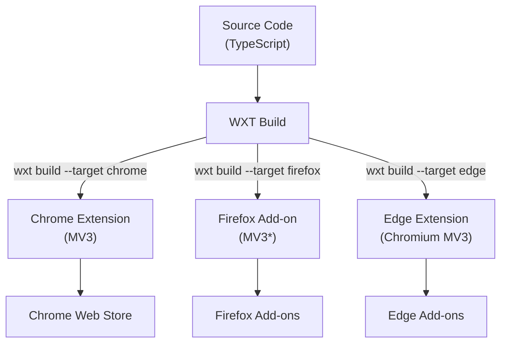

### 19.2 Browser API Abstraction

WXT provides a `browser` namespace that normalizes API differences:

| Feature | Chrome | Firefox | Our Approach |
|:---|:---|:---|:---|
| Background script | Service Worker | Service Worker (MV3) | WXT handles both |
| Side Panel | `chrome.sidePanel` | `browser.sidebarAction` | Conditional feature detection |
| Storage | `chrome.storage` | `browser.storage` | WXT `browser` polyfill |
| Offscreen API | `chrome.offscreen` | Not available | Feature detection; fallback to inline Web Worker |

### 19.3 MVP Target

- **Chrome:** Primary (P0)
- **Firefox:** Deferred to V2 (different Side Panel API)
- **Edge:** Nearly free (Chromium-based), consider for V1.1

---

## 20. Performance Budget & Considerations

### 20.1 Hard Performance Limits

| Metric | Target | Measurement |
|:---|:---|:---|
| Content script initial load | < 50ms | Performance.mark in content script |
| MutationObserver callback | < 5ms per batch | Debounced; profiled in DevTools |
| Token counting (incremental) | < 100ms | Web Worker; excludes cached messages |
| Token counting (full re-count) | < 500ms for 100K tokens | Web Worker benchmark |
| Summary generation | < 200ms for 100K tokens | Main thread benchmark |
| Widget render | < 16ms (60fps) | RequestAnimationFrame budget |
| Memory overhead per tab | < 10MB | Chrome Task Manager |
| Total extension memory | < 30MB | Chrome Task Manager |
| CPU at idle (no typing) | 0% | DevTools Performance panel |
| CPU during streaming | < 2% | DevTools Performance panel |

### 20.2 Optimization Strategies

| Strategy | Where | Benefit |
|:---|:---|:---|
| **Debounced MutationObserver** | Content Script | Prevents per-character callback storms during AI streaming |
| **Incremental tokenization** | Token Engine | Only re-tokenize changed messages |
| **Web Worker offloading** | Offscreen Document | Tokenization never blocks the UI thread |
| **Page Visibility API** | Content Script | Suspend all processing on background tabs |
| **Lazy initialization** | Service Worker | Don't load state until first event |
| **CSS containment** | Widget | `contain: layout style paint` on widget prevents layout recalcs |
| **Virtual scrolling** | Side Panel | Conversation history doesn't render all messages at once |
| **Preact (not React)** | All UI | 3KB vs 40KB+ framework size |
| **Tree-shaking** | Build | Vite eliminates dead code |
| **Separate bundles** | Build | Content script, popup, panel, worker are independent chunks |

### 20.3 Bundle Size Budget

| Bundle | Max Size (gzip) | Contents |
|:---|:---|:---|
| Content script | 15KB | Observer, adapter, widget, messaging |
| Popup | 20KB | Preact, components, hooks |
| Side panel | 40KB | Preact, all components, charts |
| Worker | 40KB | js-tiktoken, BPE engine |
| Service worker | 10KB | Event routing, state management |
| **Total extension** | **< 125KB** | All bundles combined |

---

## 21. Security Model

### 21.1 Threat Model

| Threat | Likelihood | Mitigation |
|:---|:---|:---|
| **XSS via host page** | Medium | Shadow DOM isolation; no `innerHTML` from DOM content; sanitize all extracted text |
| **Extension hijacking** | Low | Minimal permissions; no remote code loading; CSP `script-src 'self'` |
| **Data exfiltration** | Low | No network requests exist in codebase; CSP blocks all external connections |
| **Malicious DOM injection** | Low | Read-only DOM access; we never modify host page content outside Shadow DOM |
| **Storage tampering** | Low | Content scripts cannot access `chrome.storage.session` by default; validate data on read |

### 21.2 Content Security Policy

```json
{
  "content_security_policy": {
    "extension_pages": "script-src 'self'; object-src 'none'; connect-src 'none'"
  }
}
```

> [!IMPORTANT]
> **`connect-src 'none'`** — This is the most aggressive CSP possible. It means the extension literally cannot make any network requests. This is our architectural guarantee of privacy. Even if a supply-chain attack compromised a dependency, the CSP would prevent data exfiltration.

### 21.3 Permission Minimization

```json
{
  "permissions": ["storage", "sidePanel", "alarms", "offscreen"],
  "host_permissions": [
    "https://chatgpt.com/*",
    "https://chat.openai.com/*",
    "https://claude.ai/*",
    "https://gemini.google.com/*"
  ]
}
```

**Permissions we deliberately avoid:**

| Permission | Why We Don't Need It |
|:---|:---|
| `<all_urls>` | We only operate on specific AI platform URLs |
| `tabs` | We use `activeTab` behavior via content script injection |
| `webRequest` / `webRequestBlocking` | We don't intercept network traffic |
| `history` | We don't read browser history |
| `cookies` | We don't access user sessions |
| `clipboardRead` | We write to clipboard (copy summary), never read |

---

## 22. Privacy Architecture

### 22.1 Privacy by Design

```
┌──────────────────────────────────────────────┐
│              PRIVACY GUARANTEES               │
├──────────────────────────────────────────────┤
│                                              │
│  1. ZERO NETWORK CALLS                       │
│     • No analytics                           │
│     • No telemetry                           │
│     • No crash reporting to external servers │
│     • No "phone home" for updates            │
│     • CSP: connect-src 'none'                │
│                                              │
│  2. LOCAL-ONLY PROCESSING                    │
│     • Tokenization: client-side JS           │
│     • Summarization: client-side algorithms  │
│     • Storage: chrome.storage + IndexedDB    │
│     • No cloud sync of conversation data     │
│                                              │
│  3. MINIMAL DATA RETENTION                   │
│     • Session data cleared on tab close      │
│     • Conversation history opt-in only       │
│     • User can clear all data from settings  │
│                                              │
│  4. READ-ONLY HOST INTERACTION               │
│     • We read DOM, never write to host page  │
│     • Shadow DOM is isolated from host       │
│     • No form filling, no auto-submission    │
│                                              │
│  5. TRANSPARENT PERMISSIONS                  │
│     • Only access declared host domains      │
│     • No wildcard permissions                │
│     • No optional permission escalation      │
│                                              │
└──────────────────────────────────────────────┘
```

### 22.2 Data Classification

| Data Type | Sensitivity | Storage | Retention |
|:---|:---|:---|:---|
| Token counts | Low | `chrome.storage.session` | Tab session |
| Health scores | Low | `chrome.storage.session` | Tab session |
| Conversation text | **High** | Never persisted by default | In-memory only |
| Summaries | Medium | IndexedDB (opt-in) | Until user clears |
| Settings | Low | `chrome.storage.sync` | Until user changes |
| Model metadata | None | Static JSON / `chrome.storage.local` | Permanent |

---

## 23. Future Extensibility

### 23.1 Adapter Plugin System (V3+)

The adapter pattern is designed for community contributions:

```typescript
// Future: User can register custom adapters
adapterRegistry.register({
  platformId: 'deepseek',
  urlPatterns: ['https://chat.deepseek.com/*'],
  adapter: new DeepSeekAdapter(),
});
```

### 23.2 Engine Plugin Points

| Extension Point | Mechanism | Use Case |
|:---|:---|:---|
| New platform adapter | Implement `PlatformAdapter` interface | Community adds DeepSeek, Mistral, etc. |
| New token strategy | Implement `TokenStrategy` interface | Better tokenizer for a specific model |
| New degradation signal | Implement `DegradationSignal` interface | Custom quality heuristic |
| New summary format | Implement output formatter | Different transfer summary templates |
| New storage backend | Implement storage interface | Enterprise: remote storage integration |

### 23.3 Feature Flags

```typescript
const FEATURE_FLAGS = {
  // MVP (always on)
  tokenCounting: true,
  healthScore: true,
  floatingWidget: true,

  // V2 (gated by license)
  rollingSummary: false,
  transferSummary: false,
  conversationHistory: false,

  // Experimental (hidden behind settings)
  webllmSummary: false,
  customAdapters: false,
} as const;
```

---

## 24. Sequence Diagrams

### 24.1 Extension Initialization (Page Load)

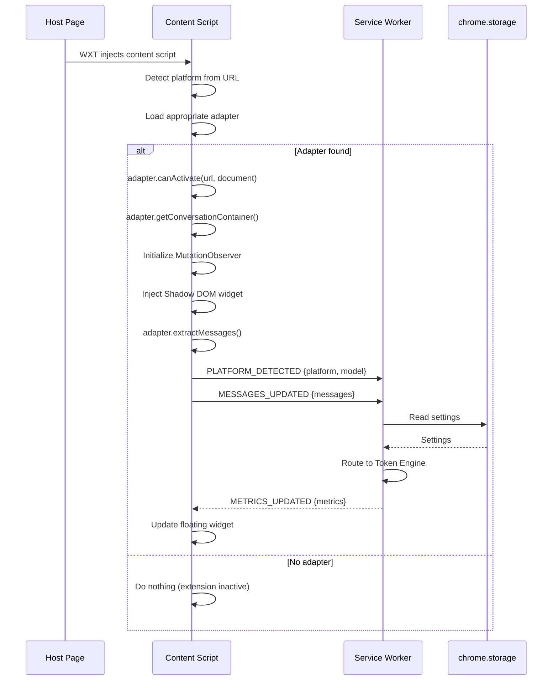

### 24.2 Real-Time Token Counting (User Sends Message)

```mermaid
sequenceDiagram
    participant User
    participant Page as Host Page
    participant MO as MutationObserver
    participant CS as Content Script
    participant SW as Service Worker
    participant OFF as Offscreen Worker
    participant Store as Storage

    User->>Page: Sends message
    Page->>Page: AI streams response
    Page->>MO: DOM mutations (token by token)
    
    Note over MO: Debounce 300ms
    
    MO->>CS: Batch of mutations
    CS->>CS: adapter.extractMessages()
    CS->>SW: MESSAGES_UPDATED
    SW->>SW: Diff against cached messages
    SW->>OFF: TOKENIZE_REQUEST (changed msgs only)
    OFF->>OFF: js-tiktoken.encode()
    OFF-->>SW: TOKENIZE_RESPONSE {counts}
    SW->>SW: Update total count
    SW->>SW: Run degradation detector
    SW->>Store: Write session state
    Store-->>CS: onChanged → new metrics
    CS->>CS: Update floating widget
    Store-->>CS: onChanged → new metrics
    Note over CS: Side Panel also receives onChanged
```

### 24.3 Transfer Summary Generation

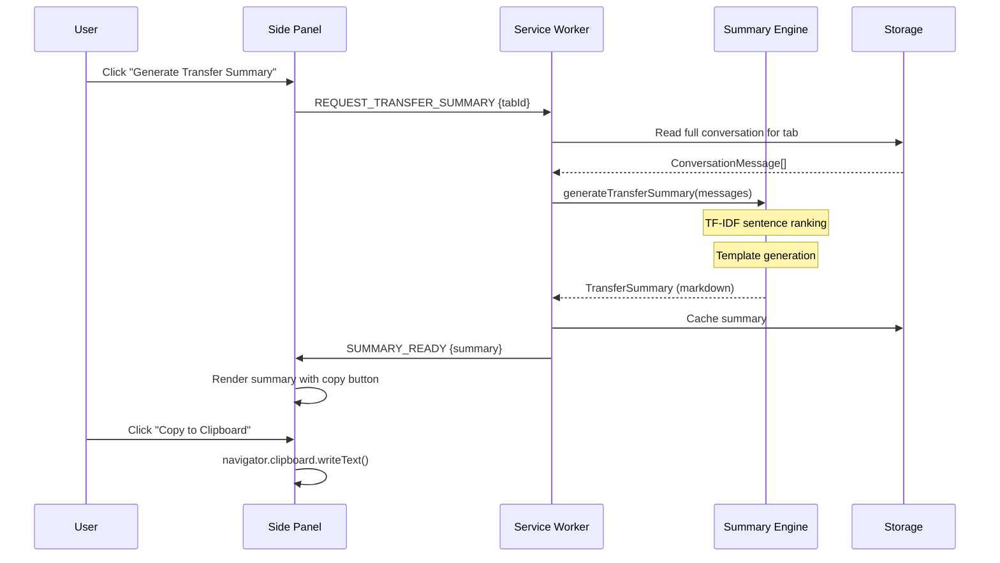

### 24.4 Degradation Alert Flow

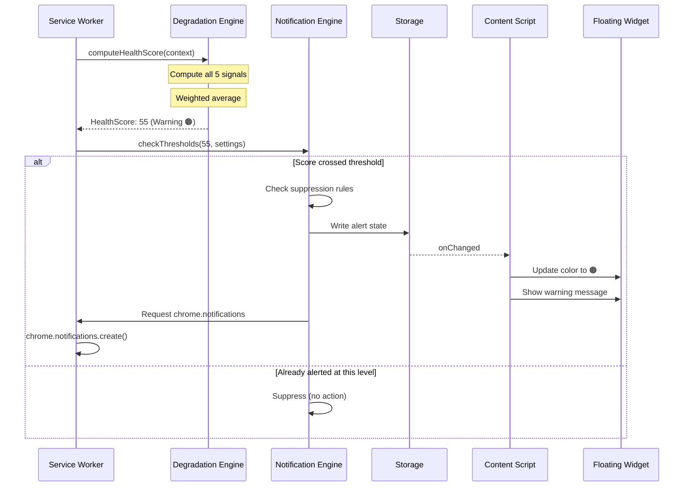

---

## 25. Interface Contracts

### 25.1 Core Types

```typescript
// ── Platform & Model ──

type PlatformId = 'chatgpt' | 'claude' | 'gemini' | 'grok' | 'perplexity';

interface ModelInfo {
  modelId: string;
  displayName: string;
  provider: PlatformId;
  contextWindow: number;
  tokenizer: TokenizerType;
  confidence: 'exact' | 'fuzzy' | 'unknown';
}

type TokenizerType = 'o200k_base' | 'cl100k_base' | 'bpe-approx' | 'sp-approx' | 'char-ratio';

// ── Messages ──

interface ConversationMessage {
  messageId: string;
  role: 'user' | 'assistant' | 'system';
  content: string;
  timestamp: number;
  tokenCount?: number;     // Cached after first count
  isStreaming?: boolean;    // True while AI is still generating
}

// ── Metrics ──

interface TabMetrics {
  tabId: number;
  platform: PlatformId;
  model: ModelInfo | null;
  tokenCount: ConversationTokenCount;
  healthScore: HealthScore;
  conversationTurns: number;
  lastUpdated: number;
}

interface HealthScore {
  overall: number;          // 0-100
  level: 'healthy' | 'caution' | 'warning' | 'critical';
  signals: Record<string, SignalResult>;
}

interface SignalResult {
  value: number;            // 0-100 (0 = healthy, 100 = critical)
  weight: number;
  description: string;
}

// ── Adapter ──

interface AdapterHealthReport {
  platform: PlatformId;
  timestamp: number;
  primarySelectorsWorking: boolean;
  fallbackSelectorsWorking: boolean;
  broken: boolean;
  failedSelectors: string[];
}

// ── Summary ──

interface TransferSummary {
  generatedAt: number;
  sourcePlatform: PlatformId;
  sourceModel: string;
  conversationTurns: number;
  totalTokens: number;
  markdown: string;           // The formatted transfer summary
}
```

### 25.2 Dependency Direction Enforcement

```
shared/ ← adapters/ ← content/
    ↑         ↑
    │    engines/token/ ← offscreen/
    │    engines/summary/
    │    engines/degradation/
    │         ↑
    ├── storage/ ← background/
    ├── messaging/ ← background/, content/, sidepanel/, popup/
    ├── settings/ ← background/, options/
    ├── notifications/ ← background/
    └── models/ ← engines/, background/
    
    ui/components/ ← sidepanel/, popup/, widget/
    ui/hooks/ ← sidepanel/, popup/
```

Arrows indicate "is imported by." No circular dependencies allowed.

---

*This architecture is designed to be implemented incrementally. Each layer can be built and tested independently before integration. The adapter pattern and interface contracts ensure that adding new platforms never requires modifying existing code — only adding new adapter modules.*
