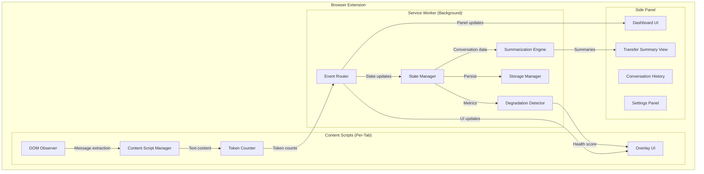

# AI Context Tracker — Product Specification

> **Document Version:** 1.0  
> **Date:** July 13, 2026  
> **Status:** Draft — Awaiting Founder Approval  
> **Author:** Senior Architect / Product Lead

---

## 1. Executive Summary

**AI Context Tracker** is a privacy-first browser extension that gives AI power users real-time visibility into how much of an AI model's context window they've consumed, warns them before performance degrades, and provides intelligent tools to transfer conversation context between AI platforms.

Unlike existing token counters that serve a single platform or provide only basic metrics, AI Context Tracker is designed as a **unified AI workspace companion** — a single pane of glass for understanding, optimizing, and preserving AI conversation quality across all major platforms.

### The Core Insight

> Every AI chat user has experienced the moment where the AI "forgets" what you told it 20 messages ago. Most users don't understand why. The few who do have no tools to manage it proactively. **AI Context Tracker makes the invisible visible.**

---

## 2. Problem Statement

### 2.1 The User Pain Points

| Pain Point | Severity | Current Solution |
|:---|:---:|:---|
| AI "forgets" earlier instructions mid-conversation | **Critical** | None — users restart and re-explain |
| No visibility into how much context window is consumed | **High** | Fragmented per-platform tools |
| Hitting usage/rate limits unexpectedly | **High** | Manual tracking or guessing |
| Losing conversation context when switching between AI tools | **High** | Manual copy-paste |
| Not knowing which AI model to use for remaining task | **Medium** | Trial and error |
| Paying for degraded output quality without realizing it | **Medium** | None |

### 2.2 Who Experiences This

- **Power users** who maintain long coding/writing sessions with AI
- **Developers** using AI for multi-file codebases and architecture decisions
- **Researchers** conducting deep analysis across long conversations
- **Content creators** with complex multi-turn creative workflows
- **Consultants/professionals** using multiple AI platforms for different strengths
- **Teams** collaborating and sharing AI conversation context

---

## 3. Competitive Landscape

### 3.1 Direct Competitors

| Product | Platforms | Key Features | Weaknesses |
|:---|:---|:---|:---|
| **Token Track** | Claude, ChatGPT, Gemini, Grok, Perplexity | Real-time token counting, cost estimation, minimal widget | DOM estimation only (85-95% accuracy on non-Claude platforms); no context transfer; no degradation warnings; single-purpose |
| **AI Limit Checker** | Claude, ChatGPT, Grok, Gemini, Perplexity | DOM scanning + network interception, session reset timers | No rolling summaries; no transfer capabilities; reactive not proactive |
| **MultiToken Counter** | ChatGPT, Claude, Gemini | Cumulative totals, document/image analysis | Limited platform support; no quality metrics; no context management |
| **Claude Counter** | Claude only | Open-source, minimal, usage bar tracking | Single platform; no cross-platform value |
| **TokenScope** | ChatGPT | Live tracking, auto model detection, color warnings | ChatGPT-only; no transfer or summary features |
| **Prompt Token Counter** | ChatGPT | Exact counts via `o200k_base`, draggable pill UI | ChatGPT-only; counting only, no intelligence layer |

### 3.2 Adjacent Competitors (Context Transfer)

| Product | Focus | Weaknesses |
|:---|:---|:---|
| **ContextSwitchAI** | Export/import conversations between platforms | No token tracking; no quality metrics; raw transfer without intelligent compression |
| **Context Bridge** | Migration prompts for switching platforms | No real-time monitoring; manual trigger only |
| **ContextPulse** | "Conversation quality" alerts | No token counting; no transfer; vague quality heuristics |
| **OpenMemory / LLMnesia** | Searchable conversation library | Memory-focused, not real-time; no active context monitoring |

### 3.3 Competitive Gap Analysis

> [!IMPORTANT]
> **No existing product combines all three pillars: real-time monitoring + degradation detection + intelligent context transfer.** Every competitor solves one piece. This is our opportunity.

```
┌─────────────────────────────────────────────────────────┐
│                   MARKET GAP MAP                        │
│                                                         │
│   Token Counting ←───────────→ Context Transfer         │
│        ▲                            ▲                   │
│   Token Track                  ContextSwitchAI          │
│   TokenScope                   Context Bridge           │
│   MultiToken                                            │
│        │                            │                   │
│        ▼                            ▼                   │
│   Quality Detection ←──────→ AI Context Tracker         │
│        ▲                      (OUR POSITION)            │
│   ContextPulse                      │                   │
│   (weak signal)               All three pillars         │
│                               unified in one tool       │
└─────────────────────────────────────────────────────────┘
```

---

## 4. Target Platforms (July 2026)

| Platform | Context Window | Tokenizer | DOM Stability | Priority |
|:---|:---|:---|:---|:---|
| **ChatGPT** (GPT-5.x) | 272K – 1M tokens | tiktoken (`o200k_base`) | Low (frequent UI changes) | **P0** |
| **Claude** (Fable 5 / Mythos 5) | 200K – 1M+ tokens | Proprietary BPE | Medium | **P0** |
| **Gemini** (3.1 Pro) | 1M – 2M tokens | SentencePiece | Medium | **P0** |
| **Grok** (Grok 4) | 500K – 2M tokens | Proprietary BPE | Low (rapid iterations) | **P1** |
| **Perplexity** | Varies (orchestrator) | Depends on underlying model | Medium | **P1** |

> [!NOTE]
> **Perplexity is an orchestrator**, not a single model. It routes to different underlying models (Gemini, GPT, Sonar Pro). Our extension should detect which model Perplexity is using when possible.

---

## 5. Technical Research & Engineering Challenges

### 5.1 Token Estimation Techniques

**Challenge:** Each platform uses a different tokenizer. We cannot use a single counting method.

| Approach | Accuracy | Performance | Complexity | Recommendation |
|:---|:---|:---|:---|:---|
| **Platform-specific tokenizer** (e.g., `js-tiktoken` for GPT) | 95-100% | Good | High (per-platform) | ✅ Use for ChatGPT |
| **Heuristic estimation** (chars ÷ ~4) | 60-75% | Excellent | Low | ❌ Too inaccurate |
| **Hybrid BPE approximation** | 85-92% | Good | Medium | ✅ Use for Claude, Grok |
| **Character-ratio calibration** (platform-tuned) | 80-90% | Excellent | Low | ✅ Fallback method |
| **Network request interception** | 95-100% | N/A | High (fragile) | ⚠️ Where available |

**Recommended Strategy:**
1. **GPT models:** Use `js-tiktoken` with `o200k_base` encoding — exact counts, pure JS, zero-config
2. **Claude:** Use calibrated BPE approximation + network interception where available
3. **Gemini:** Use SentencePiece-compatible approximation + Google's tokenizer if accessible
4. **Grok/Perplexity:** Use calibrated character-ratio with platform-specific tuning coefficients
5. **All platforms:** Expose confidence indicator (e.g., "~95% accurate" vs "~85% estimated")

> [!TIP]
> `js-tiktoken` is the recommended library for browser environments — pure JavaScript, 3M+ weekly downloads, supports `o200k_base` for GPT-4o/5.x models. No WASM configuration needed. WASM-based alternatives (`@dqbd/tiktoken`) offer higher throughput but add build complexity inappropriate for a browser extension.

### 5.2 DOM Observation Strategy

**Challenge:** AI platforms use React/Next.js with dynamic, obfuscated CSS class names that change between builds.

**Our approach — Resilient Multi-Signal Extraction:**

```
┌─────────────────────────────────────────────┐
│           DOM Observation Pipeline           │
├─────────────────────────────────────────────┤
│                                             │
│  1. ARIA/Semantic Selectors (Most Stable)   │
│     └─ role="log", aria-label, data-*       │
│                                             │
│  2. Structural Pattern Matching             │
│     └─ Parent-child relationships,          │
│        message container → role → content   │
│                                             │
│  3. Content Heuristics                      │
│     └─ "You" / "Assistant" markers,         │
│        code block patterns, markdown        │
│                                             │
│  4. MutationObserver (Scoped)               │
│     └─ Watch conversation container only    │
│     └─ Debounced callbacks (300ms)          │
│     └─ childList + characterData only       │
│                                             │
│  5. Self-Healing Fallback                   │
│     └─ If primary selectors fail,           │
│        fall back to structural matching     │
│     └─ Report selector failures to          │
│        background worker for diagnostics    │
│                                             │
└─────────────────────────────────────────────┘
```

**Key Performance Rules:**
- **Scope observations narrowly** — never observe `document.body` with `subtree: true`
- **Debounce all callbacks** — AI platforms stream tokens rapidly; batch processing
- **Use `attributeFilter`** — only watch attributes we care about
- **Disconnect when tab is hidden** — use Page Visibility API to suspend observation
- **Profile target: < 1% CPU** during page load

### 5.3 Manifest V3 Constraints

**Critical constraints that shape our architecture:**

| Constraint | Impact | Our Solution |
|:---|:---|:---|
| **No persistent background page** | Cannot maintain global state in memory | `chrome.storage.session` for ephemeral state; `chrome.storage.local` for persistent data |
| **Service worker termination** | Worker sleeps after ~5 min idle | Event-driven architecture; all listeners registered synchronously at top level |
| **No DOM in service worker** | Cannot do tokenization that requires DOM | Content scripts handle DOM reading; service worker handles orchestration |
| **No `setTimeout` persistence** | Timers die with worker | Use `chrome.alarms` for periodic tasks |
| **Cold start latency** | Messages may fail if worker is asleep | Retry logic with exponential backoff on all messaging |

### 5.4 Performance Degradation Detection

**Challenge:** Detecting when an AI is "losing context" is fundamentally a heuristic problem — we can't access the model's internal attention scores.

**Our proxy signals:**

| Signal | What It Indicates | Detection Method |
|:---|:---|:---|
| **Context fill percentage** | >70% fill → risk zone | Token count / known context limit |
| **Response repetition** | Model is recycling patterns | Jaccard similarity between recent responses |
| **Instruction drift** | Model stops following early instructions | Compare system prompt adherence over turns |
| **Response length collapse** | Shorter, less detailed answers | Track moving average of response token counts |
| **Explicit "I don't recall"** | Model admits memory failure | Pattern matching on responses |
| **Conversation turn count** | More turns = more risk | Simple counter with platform-specific thresholds |

**Degradation Score:** Composite weighted score (0-100) combining these signals, displayed as a "health meter" (🟢 → 🟡 → 🟠 → 🔴).

### 5.5 Rolling Summary & Transfer Summary Generation

**Critical Design Decision:** How do we generate summaries?

| Approach | Quality | Privacy | Cost | Recommendation |
|:---|:---|:---|:---|:---|
| **Use the AI being monitored** | High | ✅ No new data exposure | Free (user's existing session) | ✅ **MVP approach** |
| **Client-side small LLM (ONNX/WebLLM)** | Medium | ✅ Fully local | Free (CPU cost) | 🔮 V2 consideration |
| **Our own API endpoint** | Highest | ❌ Data leaves browser | Server costs | ❌ Privacy violation |
| **Extractive summarization (no LLM)** | Low-Medium | ✅ Fully local | Free | ✅ Fallback method |

**MVP Strategy:**
1. Use **extractive summarization** (keyword/sentence importance scoring) for the rolling summary — fully local, no API calls, no privacy concerns
2. For **transfer summaries**, generate a structured markdown template with extracted key points that the user can optionally ask their AI to refine
3. Never send conversation data to our servers

---

## 6. Product Architecture (High-Level)



### 6.1 Architecture Principles

1. **Privacy-first:** All processing happens locally. Zero network calls to our servers. Ever.
2. **Platform-agnostic core:** Business logic is decoupled from platform-specific DOM scraping
3. **Adapter pattern:** Each AI platform has its own "adapter" that normalizes the DOM into a standard message format
4. **Event-driven:** No polling, no persistent state in memory — fully MV3 compliant
5. **Graceful degradation:** If a platform changes its DOM, the extension shows "estimation mode" rather than crashing
6. **Minimal permissions:** Only request access to specific AI platform domains, never `<all_urls>`

---

## 7. Feature Specification

### 7.1 MVP (Version 1.0)

**Theme: "Make the invisible visible"**

#### Core Features

| Feature | Description | Priority |
|:---|:---|:---|
| **Context Window Meter** | Visual gauge showing % of context window consumed for current conversation | **P0** |
| **Token Counter** | Real-time token count for current conversation (input + output) | **P0** |
| **Remaining Tokens Estimate** | How many tokens remain before context limit | **P0** |
| **Degradation Health Score** | 🟢🟡🟠🔴 indicator based on proxy signals | **P0** |
| **Platform Detection** | Auto-detect which AI platform and model is being used | **P0** |
| **Accuracy Confidence** | Show whether count is "exact" or "estimated" with confidence % | **P0** |
| **Floating Widget** | Minimal, draggable overlay showing key metrics on the chat page | **P0** |
| **Side Panel Dashboard** | Detailed view with charts, history, and settings | **P1** |
| **Warning Thresholds** | Configurable alerts at 50%, 75%, 90% context fill | **P1** |
| **Conversation Turn Counter** | Track number of turns with average tokens per turn | **P1** |
| **Dark/Light Theme** | Match the AI platform's theme automatically | **P1** |

#### Supported Platforms (MVP)
- ✅ ChatGPT (chat.openai.com, chatgpt.com)
- ✅ Claude (claude.ai)
- ✅ Gemini (gemini.google.com)

#### What MVP Does NOT Include
- ❌ Rolling summaries
- ❌ Transfer summaries
- ❌ Grok / Perplexity support
- ❌ Cost estimation
- ❌ Analytics/history across sessions
- ❌ Team features

### 7.2 Version 2.0

**Theme: "Take control of your context"**

| Feature | Description |
|:---|:---|
| **Rolling Summary** | Automatic, locally-generated summary of the conversation that updates every N turns |
| **Transfer Summary Generator** | One-click generation of a structured summary designed to be pasted into another AI |
| **Grok Support** | Full adapter for x.com/grok |
| **Perplexity Support** | Adapter with underlying model detection |
| **Cost Estimation** | Estimated API cost based on token usage (for API-aware users) |
| **Session History** | Track token usage across conversations over time |
| **Export Conversation** | Export full conversation as markdown/JSON |
| **Context Optimization Tips** | Proactive suggestions (e.g., "Your system prompt is 8K tokens — consider compressing") |
| **Keyboard Shortcuts** | Quick-access shortcuts for common actions |

### 7.3 Long-Term Roadmap (V3+)

| Feature | Description | Timeframe |
|:---|:---|:---|
| **Client-side LLM summaries** | Use WebLLM / ONNX to generate high-quality summaries entirely in-browser | V3 |
| **Cross-session context memory** | Persistent knowledge graph of key facts across all AI conversations | V3 |
| **Team workspace** | Share context summaries and conversation insights with team members | V3 |
| **Firefox / Safari / Edge ports** | Cross-browser support via WebExtension APIs | V3 |
| **API mode** | For users who use AI via API (not web UI), provide a companion dashboard | V4 |
| **Analytics dashboard** | Personal AI usage analytics — which platforms, how many tokens/day, cost tracking | V3 |
| **Smart routing** | Suggest which AI platform to switch to based on task type and remaining context | V4 |
| **Prompt library** | Save and reuse effective prompts with token cost previews | V4 |
| **Enterprise features** | SSO, admin controls, usage policies, audit logs | V5 |

---

## 8. Technical Stack (Recommended)

| Layer | Technology | Rationale |
|:---|:---|:---|
| **Language** | TypeScript (strict mode) | Type safety, better tooling, catches bugs at compile time |
| **Build System** | Vite + CRXJS or WXT | Modern, fast HMR, first-class extension support |
| **UI Framework** | Preact (3KB) or Solid.js (7KB) | React-like DX without React's 40KB+ weight; critical for extension performance |
| **Styling** | CSS Modules or Vanilla Extract | Scoped styles that won't conflict with host page CSS |
| **Tokenization** | `js-tiktoken` (GPT), custom BPE (others) | Browser-compatible, zero-config, accurate |
| **State Management** | Zustand (2KB) with chrome.storage sync | Lightweight, framework-agnostic, persistence-friendly |
| **Testing** | Vitest + Playwright | Fast unit tests + real browser E2E testing |
| **Linting** | ESLint flat config + Prettier | Consistent code quality |
| **CI/CD** | GitHub Actions | Automated builds, tests, Chrome Web Store deployment |

> [!WARNING]
> **Why not React?** A browser extension's content script CSS and JS are injected into every supported page. React adds ~40KB+ of JavaScript that executes on every page load. For an extension that should be invisible to performance, this is unacceptable. Preact (3KB) provides the same component model at 1/13th the size. Solid.js is even more performant with fine-grained reactivity.

---

## 9. Business Model & Pricing

### 9.1 Recommended Model: Freemium

| Tier | Price | Features |
|:---|:---|:---|
| **Free** | $0 | Context meter, token counter, health score, 3 platforms, floating widget |
| **Pro** | $7.99/mo or $59.99/yr | All platforms, rolling summaries, transfer summaries, side panel dashboard, export, session history, priority support |
| **Team** (V3+) | $14.99/user/mo | Everything in Pro + shared workspaces, team analytics, admin controls |

### 9.2 Revenue Projections (Conservative)

| Metric | Month 3 | Month 6 | Month 12 |
|:---|:---|:---|:---|
| Free users | 5,000 | 20,000 | 80,000 |
| Conversion rate | 2% | 3% | 3.5% |
| Paying users | 100 | 600 | 2,800 |
| MRR | $799 | $4,794 | $22,372 |
| ARR | $9,588 | $57,528 | $268,464 |

### 9.3 Monetization Principles

1. **Free tier must be genuinely useful** — not a crippled demo. Users should love the free product.
2. **Pro features should save time, not gate basic functionality** — summaries and transfers are workflow accelerators, not basics.
3. **No data monetization. Ever.** — Privacy is our brand promise. Violating it would be fatal.
4. **No token/usage credits** — Flat subscription avoids user anxiety about "using up" their allowance.

### 9.4 Distribution

- **Primary:** Chrome Web Store (90% of target users)
- **Secondary:** Firefox Add-ons, Edge Add-ons (V3)
- **Marketing:** Product Hunt launch, Reddit (r/ChatGPT, r/ClaudeAI, r/artificial), Twitter/X, developer communities, AI newsletter sponsorships
- **Open-source core:** Consider open-sourcing the monitoring engine to build trust and community

---

## 10. Risks & Mitigations

| Risk | Severity | Likelihood | Mitigation |
|:---|:---|:---|:---|
| **AI platforms change DOM frequently** | High | **Very High** | Adapter pattern with fallback strategies; automated selector health monitoring; community reporting |
| **AI platforms block/restrict extensions** | Critical | Medium | Minimal DOM modification; read-only approach; comply with platform ToS; provide value that platforms may eventually want to integrate |
| **Tokenizer accuracy varies** | Medium | High | Multi-strategy approach; transparency about confidence levels; continuous calibration |
| **User privacy concerns** | High | Medium | Zero-network architecture; open-source core; third-party security audit; transparent privacy policy |
| **Chrome Web Store rejection** | Medium | Low | Follow all CWS policies; minimal permissions; clear privacy disclosures |
| **Competitor copies features** | Medium | High | Speed of execution; superior UX; brand trust; community moat |
| **Context windows grow so large degradation becomes rare** | Medium | Medium | Pivot to "AI usage analytics" and "context transfer" as primary value props |

---

## 11. Success Metrics

### 11.1 MVP Launch (First 90 Days)

| Metric | Target |
|:---|:---|
| Chrome Web Store installs | 5,000+ |
| Weekly active users | 2,000+ |
| Average rating | 4.5+ stars |
| Crash-free sessions | 99.5%+ |
| CPU overhead per page | < 1% |
| Memory overhead | < 15MB |

### 11.2 Growth Phase (6-12 Months)

| Metric | Target |
|:---|:---|
| Total installs | 50,000+ |
| WAU | 15,000+ |
| Free → Pro conversion | 3%+ |
| MRR | $10,000+ |
| NPS score | 50+ |

---

## 12. Implementation Phases

### Phase 1: Foundation (Weeks 1-2)
- Project scaffolding (TypeScript, Vite, build pipeline)
- Manifest V3 setup with proper permissions
- Service worker architecture
- Chrome storage layer
- Message passing infrastructure
- Basic content script injection

### Phase 2: Platform Adapters (Weeks 3-4)
- ChatGPT DOM adapter
- Claude DOM adapter
- Gemini DOM adapter
- Platform detection engine
- Model detection logic
- Automated adapter health checks

### Phase 3: Token Estimation Engine (Week 5)
- `js-tiktoken` integration for GPT models
- BPE approximation engine for Claude/Grok
- Character-ratio calibration system
- Confidence scoring
- Performance optimization (Web Worker offloading)

### Phase 4: Degradation Detection (Week 6)
- Response pattern analysis
- Health score computation
- Threshold configuration
- Alert system

### Phase 5: UI — Floating Widget (Weeks 7-8)
- Shadow DOM encapsulated widget
- Context meter visualization
- Health score indicator
- Token count display
- Drag-and-drop positioning
- Theme auto-detection
- Responsive to streaming responses

### Phase 6: UI — Side Panel Dashboard (Weeks 9-10)
- Detailed metrics view
- Conversation history
- Settings management
- Warning threshold configuration

### Phase 7: Polish & Launch (Weeks 11-12)
- Performance profiling and optimization
- End-to-end testing across all platforms
- Chrome Web Store submission
- Documentation
- Landing page

---

## 13. Open Questions for Founder

> [!IMPORTANT]
> These decisions need your input before we proceed to implementation:

1. **UI framework:** Preact (3KB, React-compatible) vs Solid.js (7KB, faster runtime)? I recommend **Preact** for MVP — familiar React patterns, smallest footprint, easier hiring.

2. **Build tool:** WXT (purpose-built for extensions, excellent DX) vs CRXJS + Vite (more flexible but more configuration)? I recommend **WXT** — it handles MV3 quirks automatically and has strong community adoption.

3. **Open-source strategy:** Full open-source? Open-source core with proprietary premium features? Or fully proprietary? I recommend **open-source core** (monitoring engine) with proprietary premium features (summaries, transfer, analytics).

4. **MVP platform priority:** My recommendation is ChatGPT + Claude + Gemini. Should we drop one to ship faster, or is all three mandatory for MVP?

5. **Pricing:** $7.99/mo feels right for individual power users. Too high? Too low? Should we consider a lifetime deal for early adopters?

6. **Name:** "AI Context Tracker" is descriptive but long. Should we consider shorter brand names? (e.g., "ContextFlow", "TokenPulse", "AIMeter", "ContextLens")

---

## 14. Appendices

### A. Tokenizer Reference

| Model Family | Tokenizer | Encoding | Library | Accuracy in Browser |
|:---|:---|:---|:---|:---|
| GPT-4o / GPT-5.x | tiktoken | `o200k_base` | `js-tiktoken` | ~99% |
| Claude (Fable/Mythos) | Proprietary | Unknown BPE | Custom approximation | ~85-90% |
| Gemini (3.1 Pro) | SentencePiece | Proprietary | Custom approximation | ~85-90% |
| Grok (4.x) | Proprietary | BPE-based | Custom approximation | ~80-88% |
| Perplexity | Varies | Depends on routing | Model-specific | ~75-85% |

### B. Context Window Quick Reference (July 2026)

| Model | Default Window | Extended Window |
|:---|:---|:---|
| GPT-5.4/5.5 | 272K tokens | 1M tokens |
| Claude Fable 5 | 200K tokens | 1M+ tokens |
| Claude Mythos 5 | 200K tokens | 1M+ tokens |
| Gemini 3.1 Pro | 1M tokens | 2M tokens (beta) |
| Grok 4 | 500K tokens | 2M tokens |

### C. Chrome Extension Permission Budget

```json
{
  "permissions": [
    "storage",
    "sidePanel",
    "alarms",
    "activeTab"
  ],
  "host_permissions": [
    "https://chat.openai.com/*",
    "https://chatgpt.com/*",
    "https://claude.ai/*",
    "https://gemini.google.com/*",
    "https://x.com/i/grok*",
    "https://www.perplexity.ai/*"
  ]
}
```

> [!NOTE]
> We intentionally avoid `<all_urls>`, `tabs`, `webNavigation`, and `webRequest` permissions. Every permission we request should be justifiable in our Chrome Web Store listing.

### D. Key Technical Decisions Log

| Decision | Choice | Rationale |
|:---|:---|:---|
| Shadow DOM for overlay UI | ✅ Yes | Prevents CSS conflicts with host page |
| Web Workers for tokenization | ✅ Yes | Offloads CPU from main thread |
| `chrome.storage.session` for ephemeral state | ✅ Yes | MV3 compliant, survives service worker restarts |
| No WASM for MVP | ✅ Correct | `js-tiktoken` (pure JS) avoids build complexity; WASM only if we hit perf bottlenecks |
| Side Panel over popup | ✅ Yes | Persistent, stateful, doesn't close on click-away |
| Extractive summarization (no LLM) for MVP | ✅ Yes | Privacy-first; no API dependency; deterministic |

---

*This document should be treated as a living specification. It will evolve as we validate assumptions during implementation and receive user feedback.*
